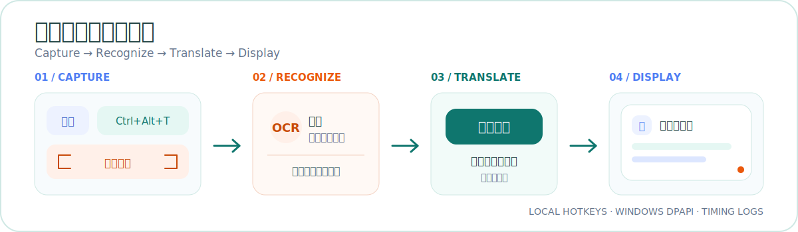

<p align="center">
  
</p>

<p align="center">
  <a href="./README.md">简体中文</a> · <a href="./README_EN.md">English</a>
</p>

<p align="center">
  
  
  
  <a href="./LICENSE"></a>
</p>

旁译让翻译停留在当前工作流里：划选文本或框选屏幕，译文直接显示在鼠标附近，不需要复制到另一个应用再切回来。

## 实际界面

<p align="center">
  
</p>

<p align="center">
  
</p>

## 核心体验

- **划词即译**：在任意支持复制的应用中拖动选择文本，释放鼠标后自动翻译。
- **三组全局快捷键**：文本翻译、截图翻译和划词开关都能在设置页修改。
- **截图识别**：调用 Windows 截图工具，通过百度 OCR 识别屏幕文字后继续翻译。
- **就近显示**：圆角浮窗默认出现在鼠标旁，也可以拖动固定、调整大小或保持置顶。
- **本机保护**：百度凭据使用 Windows DPAPI 加密，日志不保存原文、译文或凭据。
- **可诊断**：剪贴板、OCR、网络请求和总耗时都有分阶段日志。

## 工作方式

<p align="center">
  
</p>

文本选区会直接进入翻译；截图会先经过百度 OCR。网络操作在后台线程执行，结果由主界面线程显示，避免阻塞窗口交互。

## 三步开始

### 1. 准备环境

- Windows 10 或 Windows 11
- Python 3.10 或更高版本
- Python 安装中可用的 Tcl/Tk 运行环境
- 可访问百度服务的网络连接

### 2. 下载并运行

```powershell
git clone https://github.com/yhsx29/SideTranslate.git
cd SideTranslate
python main.py
```

也可以双击 `start.bat`。最小化主窗口后，全局快捷键和划词监听仍会继续工作；关闭主窗口会退出程序。

### 3. 填写百度凭据

打开“设置”页并填写需要的服务凭据：

| 功能 | 百度服务 | 凭据 |
| --- | --- | --- |
| 文本翻译 | [百度翻译开放平台](https://fanyi-api.baidu.com/) | `App ID`、密钥 |
| 截图文字识别 | [百度智能云 OCR](https://cloud.baidu.com/product/ocr.html) | `API Key`、`Secret Key` |

只使用文本翻译时，不需要 OCR 凭据。

## 默认快捷键

| 操作 | 快捷键 |
| --- | --- |
| 翻译选中文本 | `Ctrl+Alt+T` |
| 截图翻译 | `Ctrl+Alt+S` |
| 开启或关闭划词翻译 | `Ctrl+Alt+A` |
| 退出程序 | 主窗口中按 `Ctrl+Q` |

前三个快捷键都可以在设置页修改。

## 构建 Windows 版本

```powershell
powershell -ExecutionPolicy Bypass -File .\build.ps1
```

首次构建会安装 PyInstaller，产物位于 `dist\SideTranslate\SideTranslate.exe`。当前采用目录发布模式，运行或分发时需要保留完整的 `dist\SideTranslate` 文件夹。

<details>
<summary>创建 GitHub Release 压缩包</summary>

```powershell
Compress-Archive `
  -Path .\dist\SideTranslate `
  -DestinationPath .\SideTranslate-Windows-x64.zip `
  -Force
```

</details>

## 配置、日志与隐私

| 内容 | 位置 |
| --- | --- |
| 配置 | `%APPDATA%\SideTranslate\config.json` |
| 日志 | `%APPDATA%\SideTranslate\logs\app.log` |

- 凭据通过 Windows DPAPI 加密，仅当前 Windows 用户可以解密。
- 日志按 1 MB 滚动，保留 3 个历史文件。
- 文本翻译会将选区文本发送到百度翻译 API。
- 截图翻译会将图片发送到百度 OCR，再将识别文本发送到百度翻译 API。

<details>
<summary>查看性能日志事件</summary>

| 日志事件 | 含义 |
| --- | --- |
| `selection.capture.complete` | 复制选区和读取剪贴板耗时 |
| `screenshot.capture.complete` | 等待截图和读取图片耗时 |
| `ocr_auth.complete` | OCR 鉴权耗时 |
| `http.complete operation=ocr` | OCR 网络请求耗时 |
| `http.complete operation=translation` | 翻译网络请求耗时 |
| `operation.complete` | 本次操作总耗时 |

</details>

## 开发

运行测试：

```powershell
python -m unittest discover -s tests -v
```

<details>
<summary>项目结构</summary>

```text
.
├── main.py                       # 程序入口
├── side_translate/
│   ├── app.py                    # 主窗口、浮窗与事件流程
│   ├── baidu.py                  # 百度翻译和 OCR 客户端
│   ├── config.py                 # 配置与 DPAPI 加密
│   ├── logging_setup.py          # 滚动日志
│   └── windows.py                # 全局快捷键、鼠标钩子和剪贴板
├── tests/test_core.py            # 核心逻辑测试
├── build.ps1                     # PyInstaller 打包脚本
└── start.bat                     # 无控制台窗口启动脚本
```

</details>

## 已知限制

- 当前仅支持 Windows。
- 从管理员权限应用复制文本时，旁译可能也需要以管理员身份运行。
- 不支持标准复制操作的应用无法使用划词翻译，可以改用截图翻译。
- 百度 API 的延迟、配额和频率限制由对应账号套餐决定。

## 许可证

本项目使用 [MIT License](./LICENSE)。
