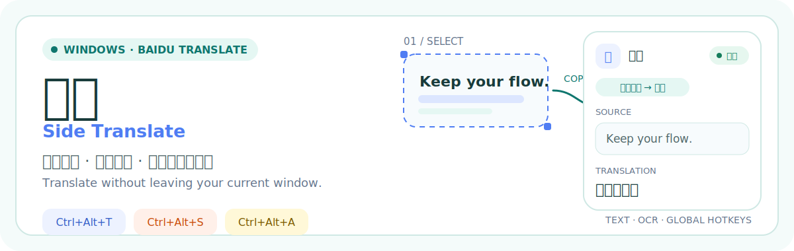
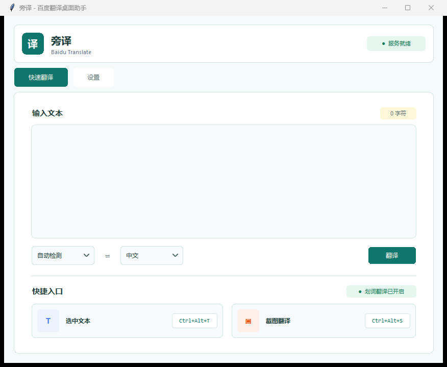
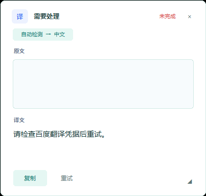
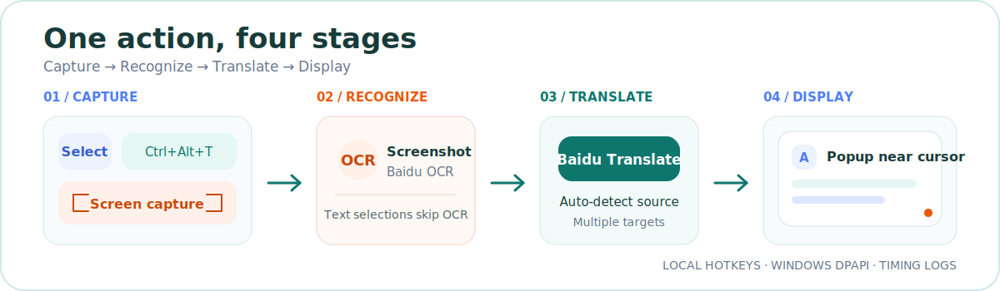

<p align="center">
  
</p>

<p align="center">
  <a href="./README.md">简体中文</a> · <a href="./README_EN.md">English</a>
</p>

<p align="center">
  
  
  
  <a href="./LICENSE"></a>
</p>

Side Translate keeps translation inside your current workflow: select text or capture part of the screen, and the result appears near the cursor without switching to another application.

## Real Interface

<p align="center">
  
</p>

<p align="center">
  
</p>

## Core Experience

- **Translate on selection**: drag to select text in any application that supports copying, then release the mouse.
- **Three global hotkeys**: text translation, screenshot translation, and the selection-translation toggle are configurable.
- **Screenshot OCR**: open Windows Screen Snipping, recognize the selected region with Baidu OCR, then translate it.
- **Results in context**: the rounded popup appears near the cursor and can be moved, resized, pinned, or kept on top.
- **Local credential protection**: Baidu credentials are encrypted with Windows DPAPI; logs exclude source text, translations, and credentials.
- **Built-in diagnostics**: clipboard, OCR, network, and total timings are logged by stage.

## How It Works

<p align="center">
  
</p>

Text selections go directly to translation, while screenshots first pass through Baidu OCR. Network work runs on background threads, and the main UI thread displays the result without freezing the window.

## Start in Three Steps

### 1. Prepare the Environment

- Windows 10 or Windows 11
- Python 3.10 or later
- A working Tcl/Tk runtime in the Python installation
- Network access to Baidu services

### 2. Download and Run

```powershell
git clone https://github.com/yhsx29/SideTranslate.git
cd SideTranslate
python main.py
```

You can also double-click `start.bat`. Global hotkeys and mouse-selection monitoring remain active while the main window is minimized. Closing the main window exits the application.

### 3. Enter Baidu Credentials

Open Settings and enter the credentials for the services you need:

| Feature | Baidu service | Credentials |
| --- | --- | --- |
| Text translation | [Baidu Translate Open Platform](https://fanyi-api.baidu.com/) | `App ID` and secret key |
| Screenshot OCR | [Baidu Cloud OCR](https://cloud.baidu.com/product/ocr.html) | `API Key` and `Secret Key` |

OCR credentials are not required when only text translation is used.

## Default Hotkeys

| Action | Hotkey |
| --- | --- |
| Translate selected text | `Ctrl+Alt+T` |
| Screenshot translation | `Ctrl+Alt+S` |
| Toggle mouse-selection translation | `Ctrl+Alt+A` |
| Exit | Press `Ctrl+Q` in the main window |

The first three hotkeys can be changed in Settings.

## Build for Windows

```powershell
powershell -ExecutionPolicy Bypass -File .\build.ps1
```

The first build installs PyInstaller. The executable is generated at `dist\SideTranslate\SideTranslate.exe`. The build uses one-folder mode, so keep the complete `dist\SideTranslate` folder when running or distributing it.

<details>
<summary>Create a GitHub Release archive</summary>

```powershell
Compress-Archive `
  -Path .\dist\SideTranslate `
  -DestinationPath .\SideTranslate-Windows-x64.zip `
  -Force
```

</details>

## Configuration, Logs, and Privacy

| Content | Location |
| --- | --- |
| Configuration | `%APPDATA%\SideTranslate\config.json` |
| Logs | `%APPDATA%\SideTranslate\logs\app.log` |

- Credentials are encrypted with Windows DPAPI and can only be decrypted by the current Windows user.
- Logs rotate at 1 MB and retain three backups.
- Text translation sends the selected text to the Baidu Translate API.
- Screenshot translation sends the image to Baidu OCR, then sends the recognized text to Baidu Translate.

<details>
<summary>View performance log events</summary>

| Log event | Meaning |
| --- | --- |
| `selection.capture.complete` | Time spent copying the selection and reading the clipboard |
| `screenshot.capture.complete` | Time spent waiting for and reading the screenshot |
| `ocr_auth.complete` | OCR authentication time |
| `http.complete operation=ocr` | OCR network request time |
| `http.complete operation=translation` | Translation network request time |
| `operation.complete` | Total operation time |

</details>

## Development

Run the tests with:

```powershell
python -m unittest discover -s tests -v
```

<details>
<summary>Project structure</summary>

```text
.
├── main.py                       # Application entry point
├── side_translate/
│   ├── app.py                    # Main window, popup, and event flow
│   ├── baidu.py                  # Baidu Translate and OCR client
│   ├── config.py                 # Configuration and DPAPI encryption
│   ├── logging_setup.py          # Rotating application logs
│   └── windows.py                # Global hotkeys, mouse hook, and clipboard
├── tests/test_core.py            # Core logic tests
├── build.ps1                     # PyInstaller build script
└── start.bat                     # Windowed launcher
```

</details>

## Known Limitations

- Windows is the only supported platform.
- Side Translate may also need administrator privileges when copying text from an elevated application.
- Applications without standard copy support cannot use mouse-selection translation; use screenshot translation instead.
- Baidu API latency, quotas, and request-rate limits depend on the associated account plan.

## License

This project is licensed under the [MIT License](./LICENSE).
